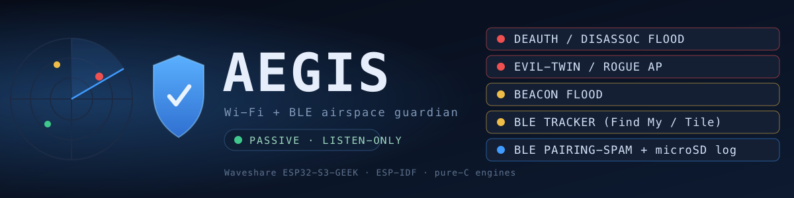
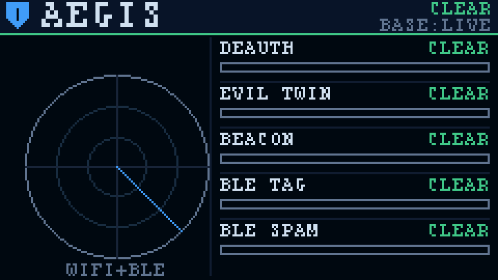
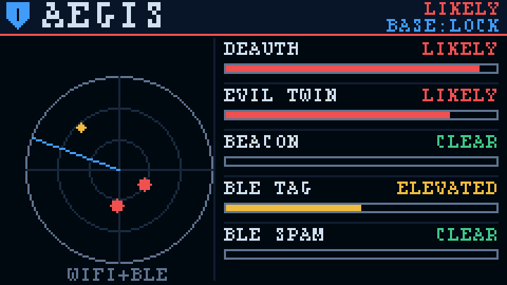
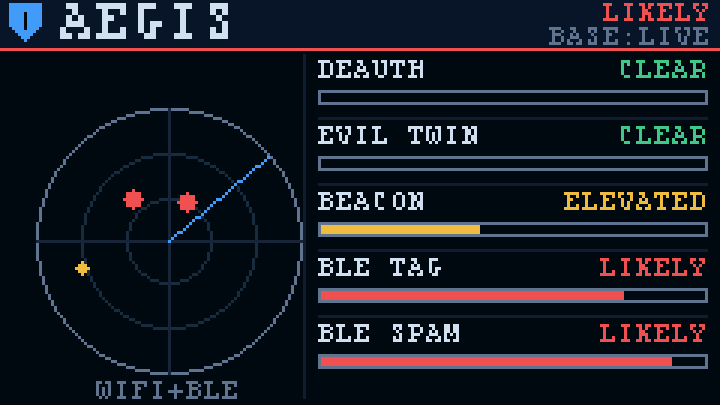

<div align="center">



# Aegis

**A pocket airspace guardian for the Waveshare ESP32-S3-GEEK.**

[](LICENSE)
[](https://www.waveshare.com/wiki/ESP32-S3-GEEK)
[](https://docs.espressif.com/projects/esp-idf/en/v5.5/)
[](#build--flash)
[](#build--flash)
[](#listen-only-by-design)

*Plug it into any USB port for power. It watches the 2.4 GHz sky and tells you when something is wrong — on its own screen, no laptop required.*

</div>

---

Aegis is a **blue-team** wireless threat monitor for the [Waveshare
ESP32-S3-GEEK](https://www.waveshare.com/wiki/ESP32-S3-GEEK). Give it USB power
and it listens — passively — to the 2.4 GHz band, feeds every Wi-Fi management
frame and BLE advertisement into five pure-C detection engines, and paints a
live threat radar on the built-in 1.14″ LCD. When it hears an attack it lights
the matching row red and writes a timestamped line to the microSD card as
evidence. No association with any network, no Flipper, no PC.

> ### Listen-only by design
> Aegis is built from receive/observer paths only. The BLE stack is compiled as
> a NimBLE **observer** with the broadcaster and peripheral roles switched *off*
> at build time; the Wi-Fi radio runs in **promiscuous (monitor)** mode. There
> is nothing in this firmware that transmits a Wi-Fi frame or advertises over
> BLE. It captures no payloads and cracks nothing.

## The dashboard

Everything Aegis knows fits on one 240×135 screen. The header tints to the worst
verdict in view; the radar plots a blip per active threat (closer to the centre
= stronger); each detector gets a row with a live verdict and a confidence bar.

<div align="center">

| All clear | Wi-Fi under attack | BLE under attack |
|:---:|:---:|:---:|
|  |  |  |
| Nothing matching a signature. | Deauth flood **+** evil-twin **LIKELY**, a tracker forming. | BLE pairing-spam **+** a Tile lingering. |

</div>

*These are rendered by the actual firmware UI code (`components/ui`) into an
off-screen buffer and exported as images — not mock-ups. Every frame is unit-
tested to prove it never draws a pixel off the panel.*

## What it detects

| # | Detector | Band | The attack | What it actually keys on |
|---|----------|------|------------|--------------------------|
| 1 | 🔴 **Deauth / disassoc flood** | Wi-Fi | Kicking clients offline (DoS, or the setup for an evil twin) | Sustained *rate* of deauth/disassoc frames in a sliding window, weighted for broadcast-addressed frames and reason-code 7 |
| 2 | 🔴 **Evil twin / rogue AP** | Wi-Fi | A look-alike of a network you trust | One SSID advertised by *contradictory* APs — a security-class change (open clone of a WPA2 net), or a new BSSID impersonating your locked baseline |
| 3 | 🟡 **Beacon flood** | Wi-Fi | Fake-AP storms (mdk3/mdk4) that drown recon | *Arrival rate* of never-before-seen BSSIDs, not the raw AP count (so a merely-busy office stays quiet) |
| 4 | 🟡 **BLE tracker sweep** | BLE | An AirTag / Tile / SmartTag following you | A tag lingering across minutes with many repeat sightings — not one that merely passes by |
| 5 | 🔵 **BLE pairing-spam** | BLE | Pop-up floods (Apple Continuity / Fast Pair / Swift Pair) | An explosion of *distinct* advertiser addresses all carrying a pairing advert in a short window |

### The honesty model

Aegis inherits one rule from the detector line it descends from: **a passive
listener can prove an attack is present; it can never prove one is absent.** So
there is no "SAFE" light. The verdicts are:

| Verdict | Meaning | Colour |
|---|---|---|
| **CLEAR** | no signature seen in this window (*not* "you are safe") | 🟢 green |
| **ELEVATED** | a signature is forming — watch it | 🟡 amber |
| **LIKELY** | a structured attack signature is sustained | 🔴 red |

Every detector has a **floor** so ordinary life doesn't cry wolf: a few deauths
are normal roaming, one SSID from two APs is normal enterprise roaming, a
tracker glimpsed once is just someone walking past. Confidence is a curve with a
ceiling of **96** — never 100 — because a receiver alone never earns certainty.

## The three field features

### 📟 On-screen radar
The LCD shows the whole picture at a glance: a scanning radar with a colour-coded
blip per live threat, five detector rows (name · verdict · confidence bar), and a
header that turns red the instant anything reaches LIKELY. Readable across a room.

### 💾 microSD evidence log
Every time a detector crosses into **LIKELY**, Aegis appends one CSV line to
`AEGIS.LOG` on the TF card, so you get a durable record of *when* and *what*:

```
# uptime_s,verdict,kind,score,mac,channel,hits,label
83,LIKELY,DEAUTH FLOOD,90,02:AA:BB:CC:DD:EE,6,214,
91,LIKELY,EVIL TWIN,80,A0:11:22:33:44:55,11,7,CorpWiFi
```

No card inserted? Aegis simply runs without logging — the detectors and screen
are unaffected.

### 🔘 Baseline-lock button
Press **BOOT** to *lock the baseline*: Aegis marks every access point it can
currently hear as trusted. From then on, a **new** BSSID claiming one of those
SSIDs — the classic evil-twin move — jumps straight to LIKELY instead of being
written off as roaming. Press again to clear and re-learn. The header shows
`BASE:LOCK` / `BASE:LIVE` so you always know the state.

## Hardware

[Waveshare ESP32-S3-GEEK](https://www.waveshare.com/wiki/ESP32-S3-GEEK) —
ESP32-S3 (16 MB flash, 2 MB PSRAM), 1.14″ ST7789 LCD, microSD, USB-A plug. The
pin map in [`main/board.h`](main/board.h) is taken from Waveshare's own demo
sources, not guessed:

| Peripheral | Bus | Pins |
|---|---|---|
| ST7789 LCD (240×135) | SPI2 | SCLK 12 · MOSI 11 · CS 10 · DC 8 · RST 9 · BL 7 |
| microSD (TF) | SPI3 | SCLK 36 · MOSI 35 · MISO 37 · CS 34 |
| BOOT button | GPIO | 0 (active-low) |

## How it works

```
        2.4 GHz radio (shared, software coexistence)
        ┌───────────────────────┬────────────────────────┐
   Wi-Fi promiscuous        NimBLE observer         BOOT button
   (mgmt-only, hopping)     (passive scan)          (baseline lock)
        │                        │                        │
        ▼                        ▼                        ▼
   ┌─────────────────── components/engine (pure C) ───────────────────┐
   │  deauth · eviltwin · beacon_flood · ble_tracker · ble_spam       │
   │  deterministic, clock-injected, host-unit-tested                 │
   └───────────────────────────────┬──────────────────────────────────┘
                                    ▼
                    components/ui (pure C canvas + 5×8 font)
                          renders 240×135 RGB565 frame
                          ┌──────────────┴──────────────┐
                          ▼                              ▼
                   ST7789 LCD                     microSD AEGIS.LOG
```

The detection engines carry **no ESP-IDF dependency**. Time is always injected
by the caller as a millisecond counter, which makes every detector deterministic
and unit-testable on a laptop — and lets the UI be rendered to images without
hardware. Wi-Fi and BLE share the single 2.4 GHz radio via software coexistence,
so each *samples* the band rather than capturing all of it.

## Build & flash

**1. Run the host tests first** — the engines and the entire UI are pure C, so
the whole suite builds and runs on your laptop in seconds (37 checks):

```bash
make -C test/host
```

**2. Build the firmware** (ESP-IDF v5.5+):

```bash
. $IDF_PATH/export.sh
idf.py set-target esp32s3
idf.py build
```

**3. Flash.** Either let ESP-IDF do it:

```bash
idf.py -p /dev/ttyACM0 flash monitor
```

…or flash the single merged image from the [release](../../releases) with
nothing but `esptool`:

```bash
esptool.py --chip esp32s3 write_flash 0x0 aegis-merged.bin
```

*(Optional) render the dashboard preview images yourself:* `make -C test/host mockups`.

## Project layout

```
Aegis-ESP32-S3-GEEK/
├── components/
│   ├── engine/            five pure-C detectors + shared threat vocabulary
│   │   ├── include/       aegis_threat.h, *_detect.h, aegis_wifi80211.h
│   │   └── src/           deauth · eviltwin · beacon_flood · ble_threat
│   └── ui/                pure-C canvas, 5×8 font, dashboard composition
├── main/                  ESP-IDF glue: Wi-Fi + BLE + display + SD + button
│   ├── aegis_main.c       app entry & the detection/UI task
│   ├── display.c          ST7789 bring-up (esp_lcd)
│   ├── sdlog.c            microSD FAT evidence log
│   └── board.h            the GEEK pin map
├── test/host/             host unit tests (no ESP-IDF) + BMP mockup renderer
└── docs/img/              banner + dashboard previews
```

## Bring-up notes

The detection logic and UI are host-verified. The parts that can only be proven
on real hardware are the display timing knobs — panel **orientation**, RGB-vs-BGR
order, 16-bit **byte order**, and backlight polarity. These are the usual
one-line tweaks in [`main/display.c`](main/display.c) and are commented there.

## Safety & ethics

Aegis is for defending networks and people: spotting the deauth flood against
your own AP, the evil twin cloning your café's SSID, the tracker that followed
you home. It captures no payloads, decrypts nothing, and transmits nothing. Use
it on airspace you are responsible for, and mind your local radio-monitoring law.

## Roadmap

- [x] Five host-verified detection engines
- [x] Wi-Fi promiscuous + NimBLE observer firmware
- [x] On-screen LCD radar dashboard
- [x] microSD evidence logging
- [x] Baseline-lock button gesture
- [ ] Flash-testing and display bring-up on hardware
- [ ] A separate, clearly-gated **red-team** counterpart — planned, *not* in this repo

> Aegis is deliberately defensive. This repository stays **blue-team,
> listen-only**. A red-team tool for the same board is a separate future project
> with its own gating.

## Credits & licence

- Firmware & engines © [at0m-b0mb](https://github.com/at0m-b0mb) — **MIT** (see [LICENSE](LICENSE)).
- 5×8 screen font: the *Font8* face from STMicroelectronics' STM32 evaluation
  LCD driver (also shipped in Waveshare's GEEK demo), **BSD-3-Clause** — notice
  retained in [`NOTICE`](NOTICE).
- Board pin map from Waveshare's ESP32-S3-GEEK demo sources.
